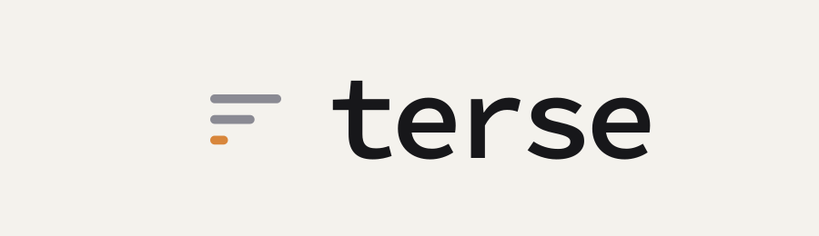
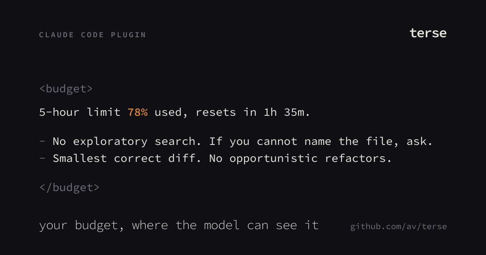
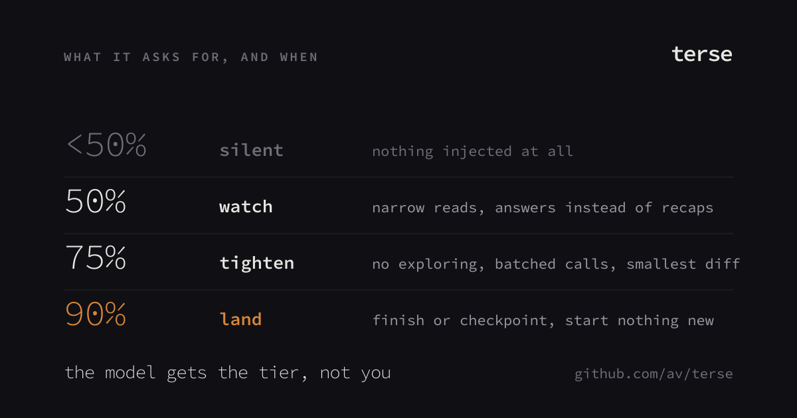
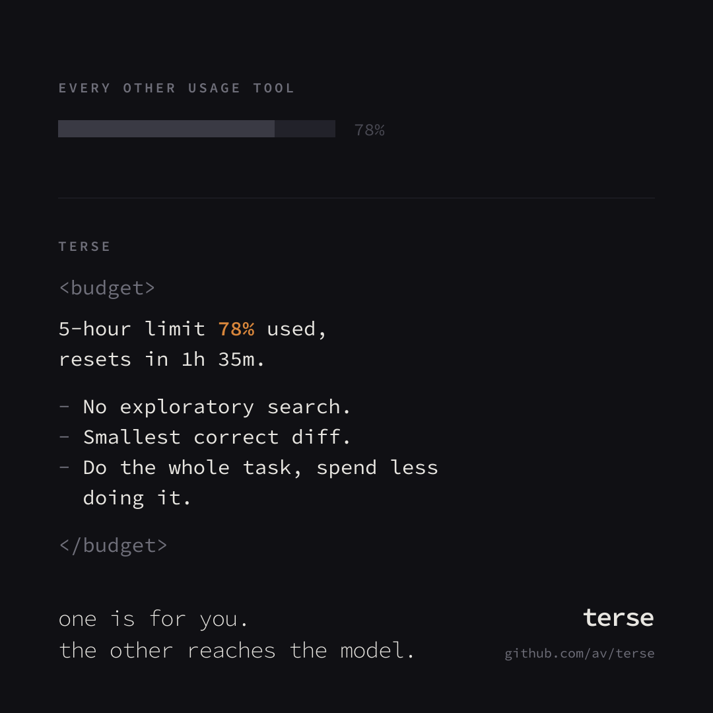

<p align="center">
  <picture>
    <source media="(prefers-color-scheme: dark)" srcset="assets/wordmark-dark.png">
    
  </picture>
</p>

<p align="center">
  
</p>

Claude Code already knows how much of your 5-hour and weekly budget is gone. It
shows that to **you**, in `/usage`, as bars. The model never sees it.

So it starts a six-file refactor with forty minutes of budget left, reads three
directories to answer a one-line question, and stops halfway through an edit.
Not because it decided the budget was worth spending. Because nobody told it
there was one.

`terse` puts the number in front of the model before your prompt lands, phrased
as something it can act on:

```
<budget>
5-hour limit 78% used, resets in 1h 35m.

- No exploratory search. If you cannot name the file, ask instead of hunting.
- Batch independent tool calls into one message. Do not re-read files already in context.
- Smallest correct diff. No opportunistic refactors, renames, or comment passes.

This is a budget constraint, not a change to what was asked. Do the whole task, spend less doing it.
</budget>
```

The scope of the work does not change. The spend on it does.

## Install

```
/plugin marketplace add av/terse
/plugin install terse@terse
```

Nothing to configure. It is silent until you cross 50%.

## What it reads

`~/.claude.json` → `cachedUsageUtilization`, the snapshot the CLI keeps for
itself and refreshes from the account usage endpoint. Same numbers `/usage`
draws.

It deliberately does **not** recount tokens from session transcripts. A local
recount drifts from the account the moment a second machine, a subagent, or
another editor spends against the same limit. The account is the only thing
that knows what you actually have left.

Check what the model is being told:

```
node scripts/cli.js status
```

```
  Window          Used    Elapsed   Resets in
  5-hour          78%     68%       1h 35m        <- binding
  weekly          41%     57%       3d

  Snapshot  5m old, from /home/you/.claude.json
```

`Elapsed` is the column that makes a percentage mean something. 78% used 68%
into the window is ordinary. 78% used 20% in is a window that will not last the
afternoon, and the nudge says so.

## Tiers

| Used | Level | What it asks for |
| --- | --- | --- |
| < 50% | — | nothing injected |
| 50% | `watch` | narrow reads, answers instead of recaps |
| 75% | `tighten` | no exploratory search, batched calls, smallest diff |
| 90% | `land` | finish or checkpoint, start nothing new |

The binding window is whichever is furthest along — the one that will actually
stop you. Only that one is mentioned.

<p align="center">
  
</p>

## Config

`~/.config/terse/config.json`, all keys optional:

```json
{
  "tiers": [
    { "at": 50, "level": "watch" },
    { "at": 75, "level": "tighten" },
    { "at": 90, "level": "land" }
  ],
  "staleAfterMinutes": 45,
  "silentAfterMinutes": 360,
  "paceSlackPoints": 10,
  "ceiling": { "enabled": false, "at": 95, "tools": ["WebSearch", "WebFetch", "Task"] }
}
```

- `staleAfterMinutes` — past this, the snapshot's age is stated in the nudge.
- `silentAfterMinutes` — past this, nothing is injected. Acting on a stale
  number is worse than acting on none.
- `paceSlackPoints` — how far ahead of the clock spending has to run before the
  nudge calls it out.
- `ceiling` — opt-in hard stop. Past `at`, the listed tools are denied with a
  reason the model can read. Off by default: a hook that blocks work is a
  bigger promise than a hook that talks.

`TERSE_OFF=1` disables everything for a session without touching config.

## Failure behaviour

Every failure is silent. No snapshot, unreadable config, malformed JSON, no
stdin — the hook exits 0 and prints nothing. A budget reminder is never worth
breaking a prompt over.

## Caveat

The snapshot is refreshed by Claude Code, not by this plugin. If you have not
run an interactive session on a machine for a while, its copy is old, and
`terse` will stay quiet rather than quote a stale percentage at the model.

## Not a dashboard

<p align="center">
  
</p>

## Prior art

[claude-code-usage-limits](https://github.com/ridelink0/claude-code-usage-limits)
does far more: turns-remaining estimates from transcript history, a live panel,
Codex and Antigravity support. Worth a look if you want the full instrument.
`terse` is the one-file version of the same idea — one number, three tiers,
nothing to read.

## Brand

`assets/` holds the mark (`logo.svg`, geometry only — three rules of decreasing
length, a paragraph getting shorter), the wordmark in both themes, and the
posters. Ink `#101014`, bone `#e8e6e1`, slate `#6f6f7a`, and one amber `#d8863b`
that only ever marks the binding window. Type is Source Code Pro throughout.

## License

MIT
